<div align="center">

<!-- Animated Header -->


<!-- Dynamic Typing Effect -->
<h1>
  
</h1>

<!-- Animated Role Description -->
<p>
  
</p>

<!-- Live Status Indicators -->
<div>
  
  
  
  
</div>

<br>

> *"I think God likes elephants. They are special."* - Terry A. Davis

</div>

<!-- Gradient Line -->


<div align="center">

## 🧬 **System Architecture**

```mermaid
graph LR
    A[JPShag] -->|writes| B[Kernel Modules]
    A -->|exploits| C[PCIe Protocol]
    A -->|designs| D[FPGA Cores]
    A -->|reverse engineers| E[Firmware]
    
    B --> F[Device Drivers]
    C --> G[DMA Attacks]
    D --> H[Hardware Acceleration]
    E --> I[UEFI Rootkits]
    
    style A fill:#6CD3FF,stroke:#0D1117,stroke-width:4px
    style B fill:#1a1b27,stroke:#6CD3FF,stroke-width:2px
    style C fill:#1a1b27,stroke:#6CD3FF,stroke-width:2px
    style D fill:#1a1b27,stroke:#6CD3FF,stroke-width:2px
    style E fill:#1a1b27,stroke:#6CD3FF,stroke-width:2px
```



<br>

> *"An idiot admires complexity, a genius admires simplicity."* - Terry A. Davis

</div>

<div align="center">

## 💻 **Technical DNA**

| 🔧 **Low-Level** | 🚀 **Systems** | 🛠️ **Hardware** | 🔐 **Security** |
|:----------------:|:--------------:|:---------------:|:---------------:|
|  |  |  |  |
|  |  |  |  |
|  |  |  |  |

</div>

<div align="center">

## 📊 **Performance Metrics**


<br>


<br>

> *"The CIA wants to steal my code."* - Terry A. Davis

</div>

<div align="center">

## 🔬 **Current Lab Work**

<table align="center">
<tr>
<td width="33%" align="center">

### 🎯 **PCIe DMA Engine**


```c
// Reality is just a suggestion
void exploit_bar_mapping() {
    volatile uint32_t* bar = 
        (uint32_t*)0xDEADBEEF;
    *bar = 0x13371337;
    // What could go wrong?
}
```

</td>
<td width="33%" align="center">

### 🛡️ **UEFI Implant**


```c
// When Ring 0 isn't low enough
EFI_STATUS persist_in_smm() {
    // Your firmware, 
    // my rules
    return EFI_SUCCESS;
}
```

</td>
<td width="33%" align="center">

### 🧠 **Neural Silicon**


```verilog
// AI, but in hardware
module neural_core(
    input clk,
    output [31:0] thoughts
);
// Magic happens here
endmodule
```

</td>
</tr>
</table>

<br>

> *"I'm not crazy, I'm inspired by God."* - Terry A. Davis

</div>

<div align="center">

## 🎵 **Code Soundtrack**

<a href="https://www.last.fm/user/swanimus">
  
</a>

<details>
<summary><b>🎧 Coding Playlist Philosophy</b></summary>

> *"The best exploits are written to breakcore, the cleanest drivers to ambient, and segfaults are debugged in complete silence."*
> 
> *"Random numbers are from God."* - Terry A. Davis

</details>

</div>

<div align="center">

## 🌍 **Digital Footprint**

```
┌─[JPShag@github]─[~/presence]─[2025-05-28 19:00:07]
└──╼ $ find / -name "JPShag" -type influence 2>/dev/null

/dev/brain/ideas/infinite
/sys/kernel/modules/custom/*
/proc/self/passion/overflow
/mnt/hardware/fpga/designs/*
/opt/exploits/responsible_disclosure/*
/home/JPShag/.config/vim/ultimate
/var/log/coffee/consumption.log (WARNING: Integer overflow)
/tmp/gods_temple/HolyC_compiler
```

<br>

> *"640x480 16 color was good enough for God."* - Terry A. Davis

</div>

<div align="center">

## 📡 **Contact & Collaboration**

<table align="center">
<tr>
<td align="center">
<h3>💼 Professional</h3>
<a href="mailto:vcpu@nvidiasoftware.com">
  
</a>
</td>
<td align="center">
<h3>🐦 Social</h3>
<a href="https://twitter.com/vcpu_sec">
  
</a>
</td>
<td align="center">
<h3>🔑 Secure</h3>

</td>
</tr>
</table>

<br>

**💡 Open to collaborating on:**
- `Kernel exploits that shouldn't work but do`
- `Hardware that thinks outside the chip`
- `Security research that keeps vendors awake`
- `Projects where "impossible" is the starting point`
- `Building God's Third Temple in silicon`

<br>

> *"God said 640x480 16 color. Not 1024x768 256 color."* - Terry A. Davis

</div>

<div align="center">

## 🏆 **Achievements Unlocked**

| 🎖️ Achievement | 🔓 Unlocked | 📝 Description |
|:--------------|:------------|:---------------|
| **Kernel Panic Master** | ✅ 2017 | Successfully crashed 100+ systems for science |
| **DMA Wizard** | ✅ 2019 | First successful PCIe DMA attack implementation |
| **Silicon Whisperer** | ✅ 2020 | Designed custom FPGA core running at 500MHz |
| **Ring -2 Resident** | ✅ 2022 | Achieved persistent SMM code execution |
| **Coffee Overflow** | ✅ Daily | Integer overflow in caffeine consumption |
| **Divine Compilation** | ✅ 2023 | Successfully compiled HolyC on bare metal |

<br>

> *"They glow in the dark, you can see them if you're driving."* - Terry A. Davis

</div>

<!-- Dynamic Footer -->


<div align="center">

```
╔═══════════════════════════════════════════════════════════════════════╗
║  "Give me a datasheet and a compiler, and I shall move the world"     ║
║                           - Archimedes, probably                      ║
║                                                                       ║
║          "God is real, unless declared integer"                       ║
║                           - Terry A. Davis                            ║
╚═══════════════════════════════════════════════════════════════════════╝
```

<br>


<br>

**Last system update:** `2025-05-28 19:00:07 UTC` | **Kernel:** `6.9.0-jpshag` | **Uptime:** `∞`

<br>

> *"After ten years, I realized God is simple, not complex."* - Terry A. Davis

</div>
